# Museumsbahn Knowledgebase

Die Knowledgebase ist eine strukturierte Sammlung von Erfahrungen, Prozessen und Anleitungen um Betreibern von Museumsbahnen einen gemeinsamen Erfahrungsaustausch zu ermöglichen.

## Für wen ist die Knowledgebase?

Die Knowledgebase richtet sich an alle, die bei einer Museumsbahn aktiv sind. Die Idee ist das Wissen über strukturierte Prozesse vereinsübergreifend zu Teilen und zwar so, dass sich jede:r einbringen kann.

Viele Museumsbahnen stehen vor den selben Herausforderungen: Wie können wir den Ticketverkauft möglichst gut gestalten? Wie können wir unsere Fahrten bewerben? Wie kann man die Arbeiten im Verein gut aufteilen?

Das Ziel der Museumsbahn IT Community ist es diese Problemstellungen gemeinsam anzugehen und Vorschläge zu finden wie man diese im Verein lösen kann. Dadurch muss nicht jeder Verein das Rad neu erfinden und man hat mehr Zeit um sich auf die eigentlichen Aufgaben zu fokussieren. 

Ein IT Hintergrund ist dabei nicht unbedingt notwendig, da es auch darum geht sich zu überlegen wie manche Problemstellungen durch strukturierte Prozesse gelöst werden können.

## Wer erstellt die Knowledgebase?

Die Knowledgebase kann von jeder Person bearbeitet werden. Änderungen werden durch sogennante "Pull Request" via GitHub eingebracht. Eine Gruppe von Personen prüft dann die eingereichten Änderungsvorschläge und akzeptiert dann die Änderungsvorschläge. Dies soll keine große Hürde darstellen, aber eine gute Qualität und Einheitlichkeit der Dokumentation sicherstellen. 

## Wie kann ich die Dokumente bearbeiten?

Das geht ganz einfach online.

Wir gehen davon aus, dass du dir bereits einen Account für github.com angelegt hast und eingeloggt bist.

#### 1. Editor öffnen

Öffne irgendeine Datei und klicke auf Bearbeiten -> mit github.dev (es macht keinen Unterschied welche Datei geöffnet wird)

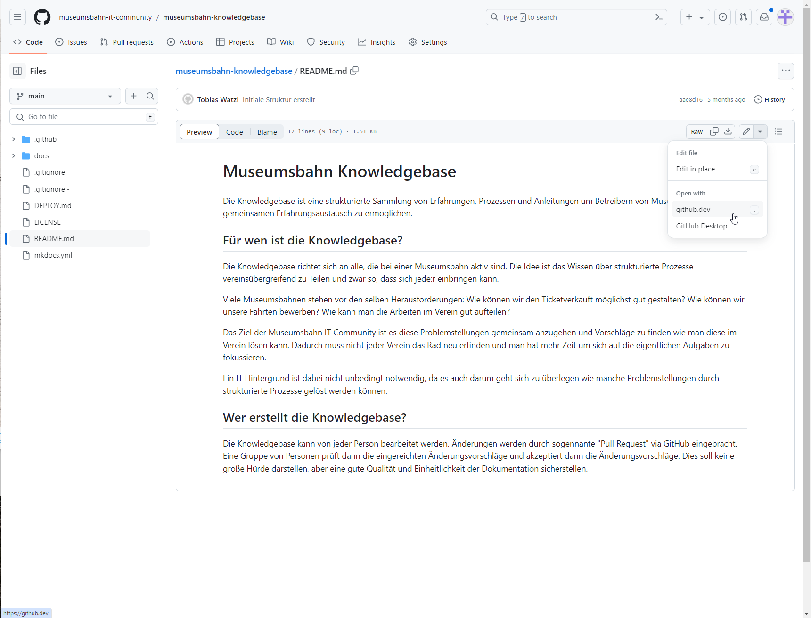

Nun hast du einen Code Editor offen (dieser entspricht ca. Visual Studio Code)

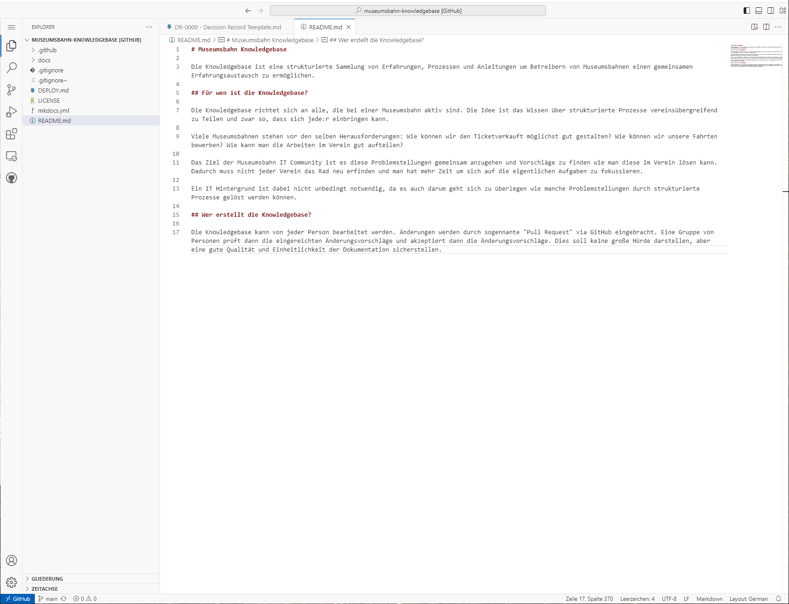

#### 2. Dateien bearbeiten

Nun kannst du die gewünschten Änderungen vornehmen

#### 3. Neuen Branch erstellen
Erstelle nun einen neuen Branch indem du links unten auf das Branch Symbol klickst, dann auf "Neuen Branch erstellen...
Nun musst du einen Namen für den Branch vergeben. Am Besten etwas, dass die Änderung gut beschreibt. Zur besseren Organisation ist es auch üblich die Branches die eigenen Initialen voranzustellen (damit man weiß wen man Fragen kann zu den Änderungen) z.B. TW/contribution_tutorial.

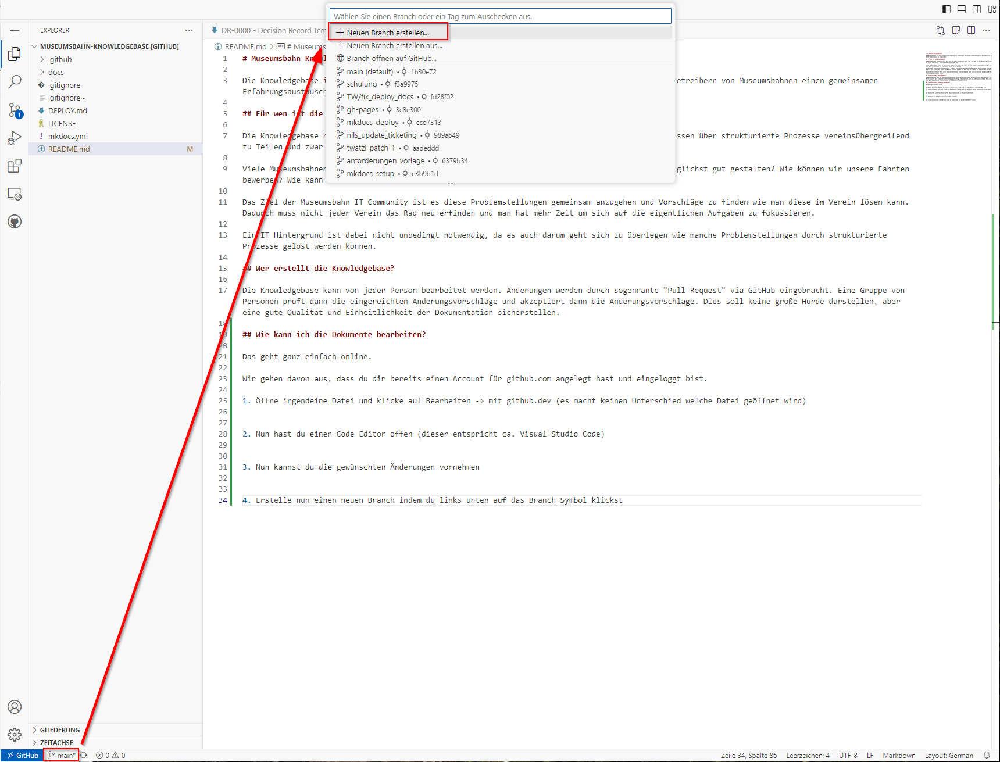
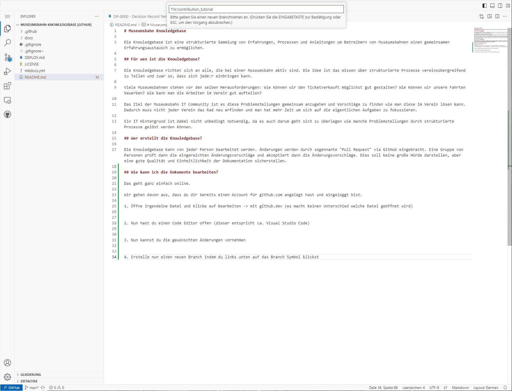

Im folgenden Dialog dann die Erstellung bestätigen.

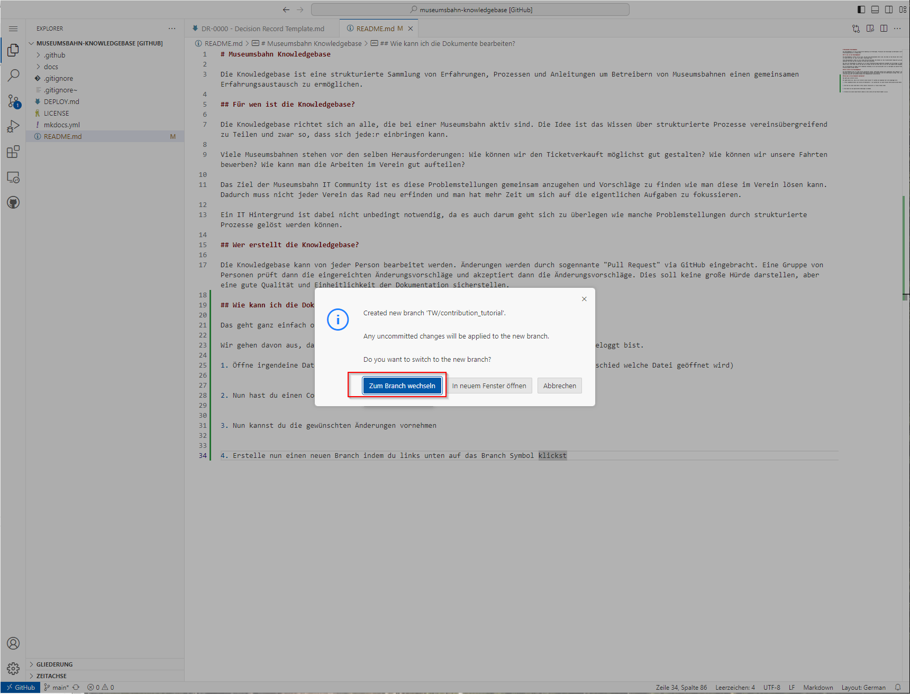

#### 4. Nun kannst du deine Änderungen Committen.

Das bedeutet, dass du deine Änderungen zu einem Packerl zusammenschnürst und draufschreibst was sich geändert hat. Git arbeitet mit Commits, die als Bausteine dienen um die Änderungen verschiedener Nutzer am Schluss zusammenzuführen. Anhand der einzelnen Commits kann man später die Änderungshistorie der Dokumente nachvollziehen.

    So erstellst du einen Commit
    1. Wechsle zur Quellcodeverwaltung
    2. Füge alle Dateien, die du in deinem Commit haben willst mit dem '+' Symbol hinzu. Dateien die nun unter "Gestagete Änderungen" aufgelistet werden, werden später im Commit drinnen sein.
    3. Verfasse eine Commit-Message: Diese sollte kurz beschreiben was geändert wurde. Sie sollte nicht zu kurz und nicht zu lange sein, aber man sollte aufgrund der Nachricht auch in einem Jahr noch ungefähr nachvollziehen können wozu die Änderung dienen sollte.

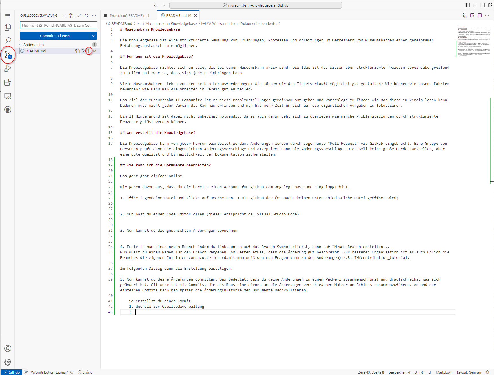
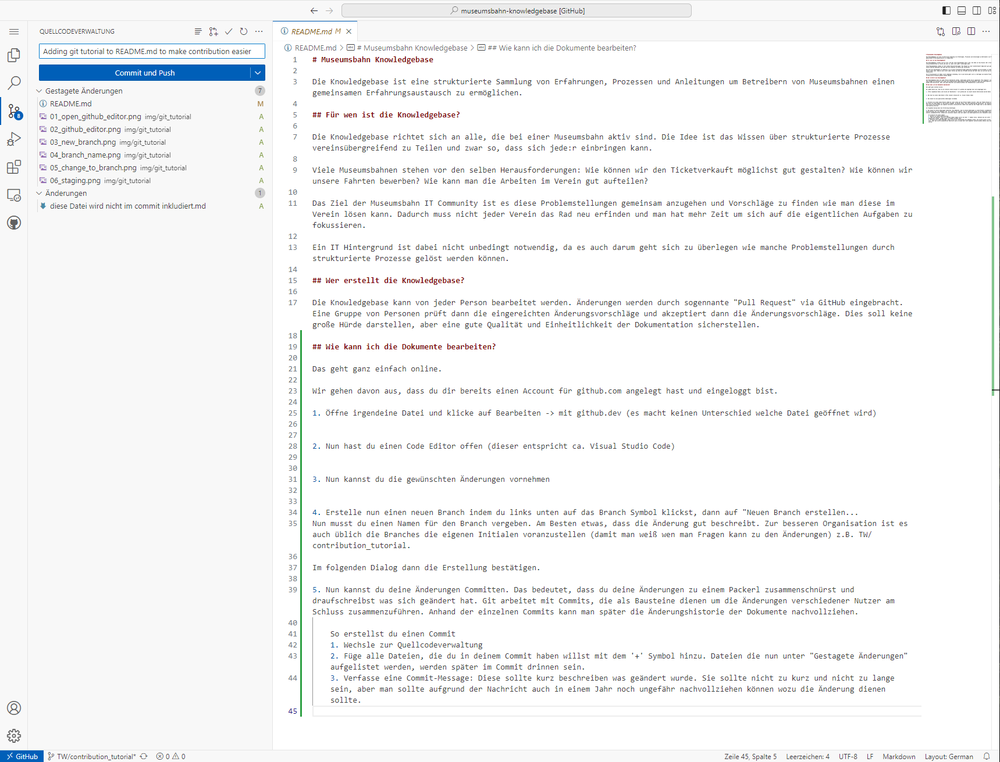
    
Du kannst auch mehrere Commits erstellen und so Zwischenstände auf GitHub sichern oder anderen Mitbearbeitern zur Verfügung stellen.

#### 5. Pull Request erstellen

Wenn du mit allen deinen Commits fertig bist musst du noch einen "Pull Request" (PR) erstellen. Das geht ganz einfach links über das Pull Request Menü. Wenn du willst kannst du hier noch Beschreibung hinzufügen. Denk immer daran, dass andere Leute deine Änderungen aufgrund der Änderungen im Code und der Beschreibung im Pull Request verstehen können sollten.

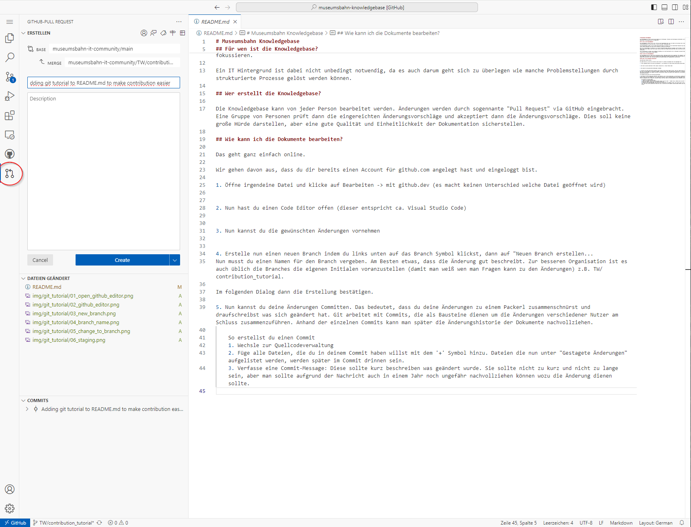
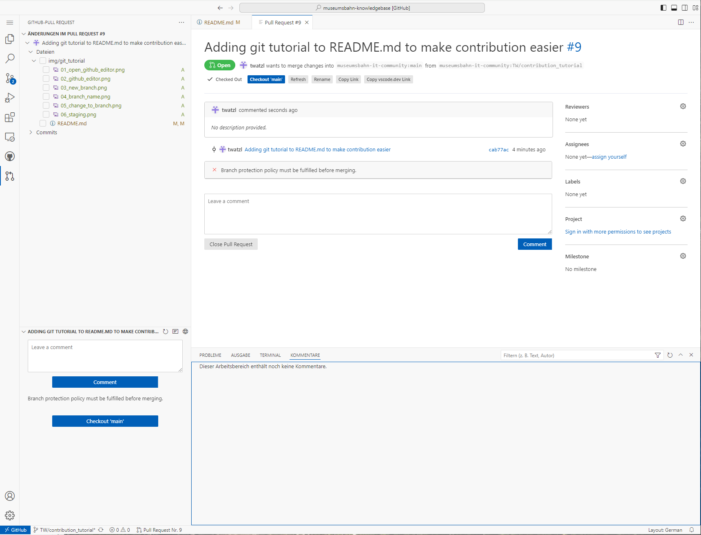

Du kannst deinen Pull Request nun auch auf der Repo Seite sehen und andere Mitbearbeiter:innen können kommentieren und Fragen stellen.
Am besten schreibst du auch noch kurz in den Discord, damit wir mitbekommen, dass es einen neuen PR gibt. In diesem Repository haben wir eingestellt, dass ALLE Pull Requests mindestens von einer Person reviewed und approved werden müssen bevor sie in den main Branch gemerged werden können. Dies soll eine hohe Qualität der Dokumentation sicherstellen.

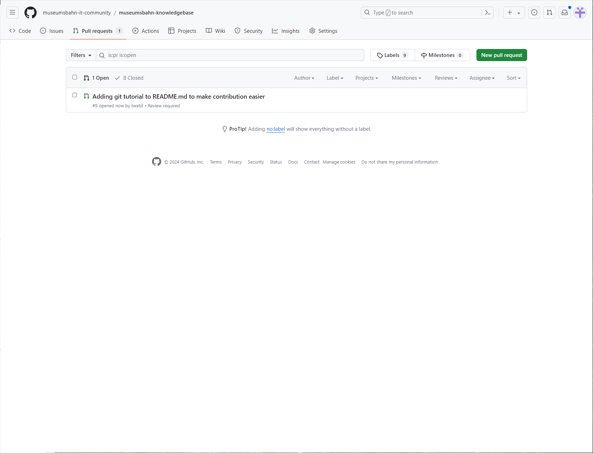
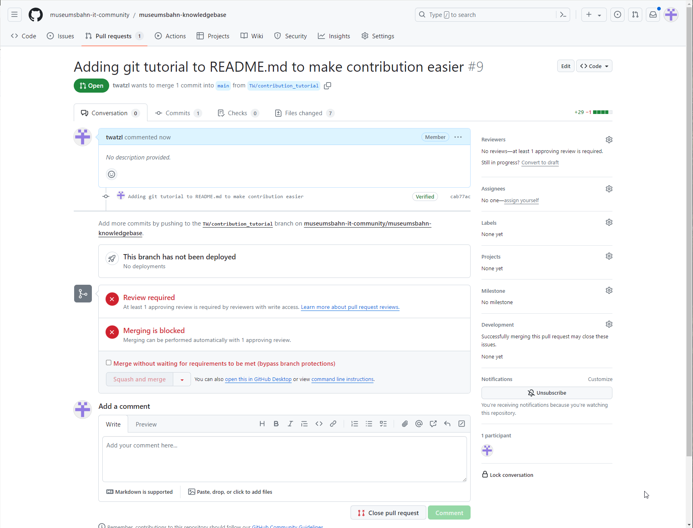