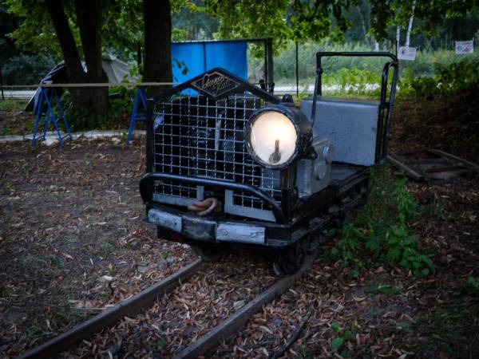

# Chaosbahn - Museumsbahnen organisatorisch vernetzen!

Beim Chaos Communication Camp 2023 versammelten sich zahlreiche Zugenthusiasten rund um [https://c3toc.de](https://c3toc.de) und nahmen am Workshop „Chaos meets Museumsbahn“ teil. Ziel war es, eine Verbindung zwischen der Chaos-Community und ehrenamtlich betriebenen Museumsbahnen herzustellen, die vom gesammelten Wissen der Chaos-Community profitieren könnten. Dieses Wiki ist ein Folgeprojekt, um alle Informationen für weitere Workshops zu sammeln und einen Einstiegspunkt in die Welt der Museumsbahnen für Chaos-Interessierte zu bieten.

Unser Ziel ist es, Museumsbahnen untereinander und mit interessierten Personen zu vernetzen, organisatorische Abläufe zu standardisieren und Wissen auszutauschen, damit nicht jede Museumsbahn das Rad neu erfinden muss. Wer in einem Museumsbahnverein tätig ist, kennt die zahlreichen organisatorischen Aufgaben wie Ticketverkauf, Veranstaltungskalender oder Verwaltung von Betriebsvorschriften.

Wir möchten Interessierte aus den Bereichen Informatik und ähnlichen Disziplinen für das Thema Eisenbahn begeistern und koordinieren. Momentan sind wir ein loser Zusammenschluss von ein paar eisenbahninteressierten Nerds aus Deutschland und Österreich.

Unser Projekt richtet sich an alle, die Interesse für Museumsbahnen haben. Es gibt viele verschiedene Aufgaben, bei denen jede Person mithelfen kann:

- Aufbau von IT-Lösungen für Vereine (Mitgliederverwaltung, Webseite, Ticketshop)
- Softwareentwicklung
- Grafikdesign
- Erstellung von Anleitungen (Social Media, Förderanträge)
- und vieles mehr!

Bist du bereits ein Vereinsmitgliede einer Museumsbahn:
Besucht uns und erzählt uns, was euch im Alltag helfen würde.
Unsere Plattform soll zum Austausch und zur gegenseitigen Unterstützung genutzt werden, um organisatorische Herausforderungen zu meistern und den Museumsbahnbetrieb zu stärken.

Wenn du mitmachen möchtest, besuche einfach unseren Discord-Server!

⭐⭐⭐⭐⭐⭐⭐⭐⭐⭐⭐⭐⭐⭐⭐⭐

👉👉👉 [https://discord.gg/ADJFadsEHB](https://discord.gg/ADJFadsEHB) 👈👈👈

⭐⭐⭐⭐⭐⭐⭐⭐⭐⭐⭐⭐⭐⭐⭐⭐
